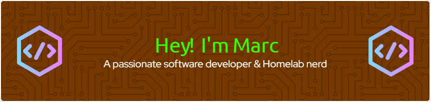

  

 
 

  

    
  

  

    <strong>About me</strong> 
      

        - 🔭 I'm currently working on: Web Apps with Laravel — and my <a href="https://thedevguymarc.github.io/Portfolio/">personal portfolio</a> (React 19, TypeScript, Vite)  
        - ✍️ I write about: Software Engineering, Legacy-Modernisierung & KI-gestützte Workflows on my <a href="https://thedevguymarc.github.io/Portfolio/blog">Blog</a>  
        - 🌱 I'm currently learning: Laravel 12 Forge + Octane  
        - ❓ Ask me about anything related to: Web Development, Legacy-Modernisierung, KI-gestützte Dev-Workflows  
        - ⚡ Fun fact: I use tabs over spaces
      

  

 
 

  
  
  
  

 
 

<h2 align="left">My Skills</h2>

<table>
  <tr>
    <th>Frontend</th>
    <th>Backend</th>
    <th>Databases</th>
  </tr>
  <tr>
    <td align="center">
      
      
      
      
      
      
      
      
      
    </td>
    <td align="center">
      
      
      
<!--       
       -->
      
      
      
    </td>
    <td align="center">
      
      
      
<!--        -->
      
    </td>
  </tr>
  <tr>
    <th>DevOps</th>
    <th>Platforms/OS</th>
    <th>Misc.</th>
  </tr>
  <tr>
    <td align="center">
      
      
      
<!--        -->
      
      
      
      
      
      
      
      
      
    </td>
    <td align="center">
      
      
      
      
      
      
      
      
    </td>
    <td align="center">
      
      
      
      
      
      
      
      
    </td>
  </tr>
</table>

<h2 align="left">Come in contact with me</h2>

###

  
  
  

###

<h2 align="left">Stats & Activity</h2>

###

  

###

  

###
